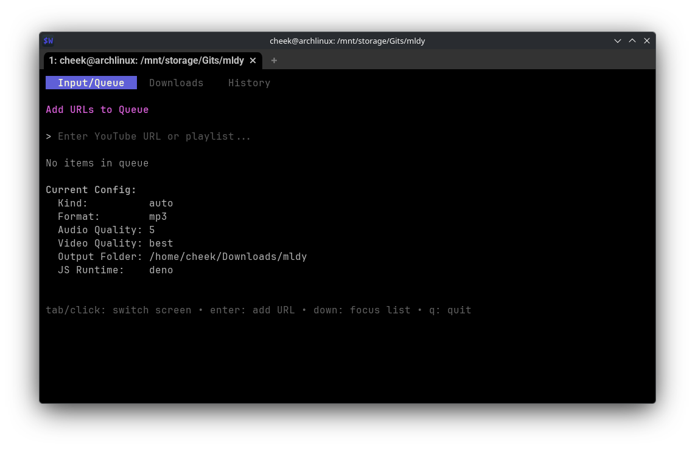
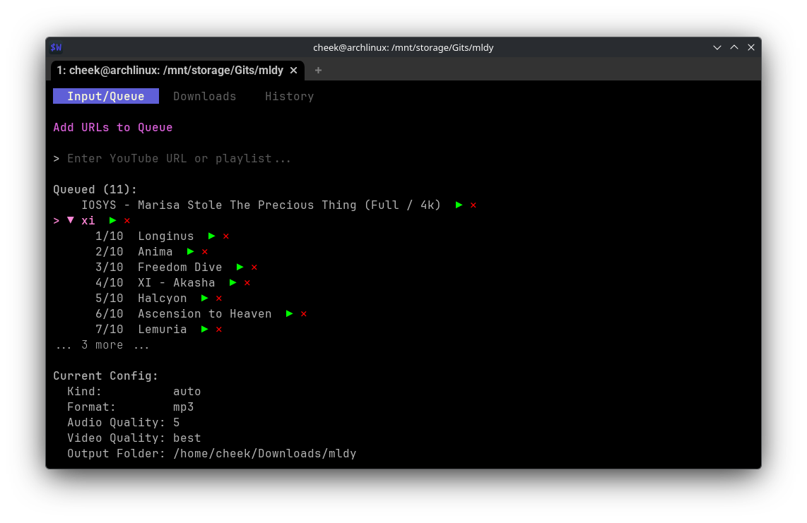
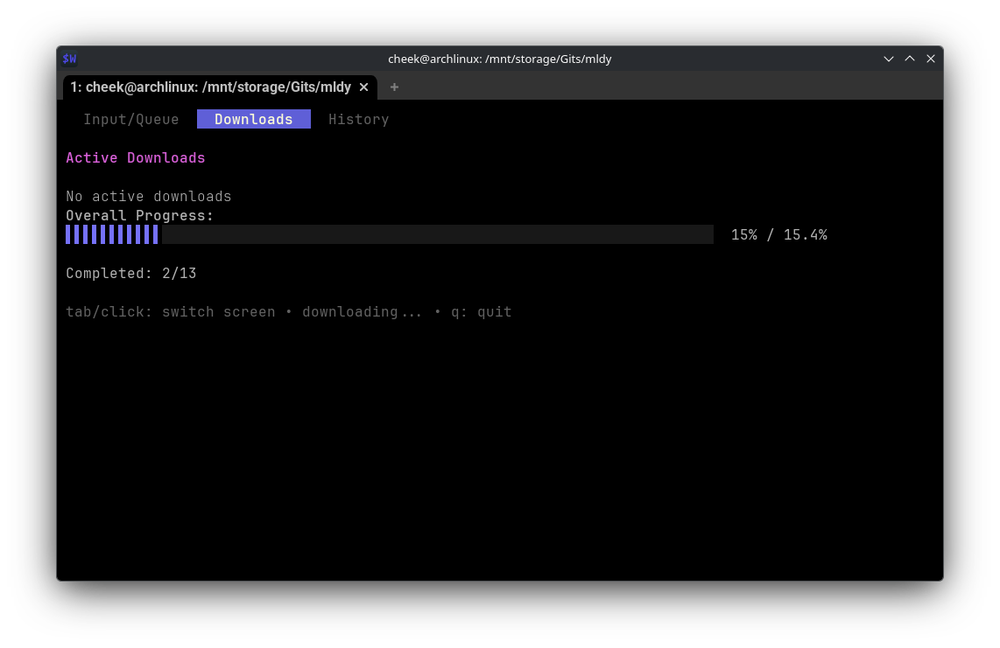
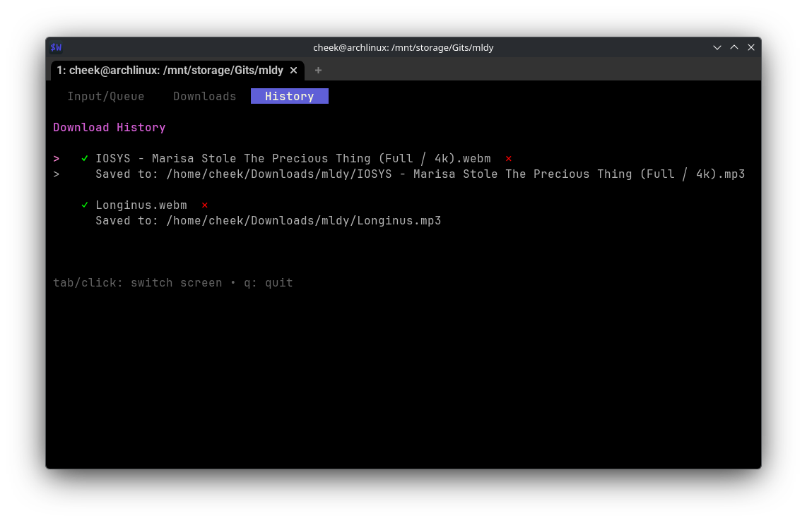

# mldy

A terminal UI for downloading videos using yt-dlp.

## Features

- Interactive TUI built with Bubble Tea
- Download multiple videos with progress tracking
- Automatic dependency installation (yt-dlp, ffmpeg, JavaScript runtime)
- Cross-platform support (Windows, Linux, macOS)

## Screenshots
<table>
  <tr>
    <td>
    <td>
  </tr>
  <tr>
    <td>
    <td>
  </tr>
</table>

## Requirements

- Go 1.25+
- yt-dlp
- ffmpeg
- JavaScript runtime (Deno ≥2, Bun ≥1.0.31, or Node.js ≥20)

## Installation

```bash
go build -o mldy
./mldy
```

The tool will automatically prompt to install missing dependencies.

## Usage

Run the executable and use the TUI to add URLs and manage downloads.
